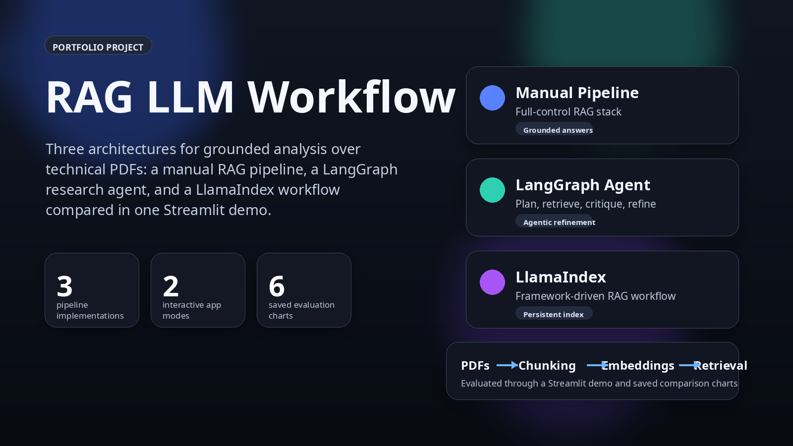
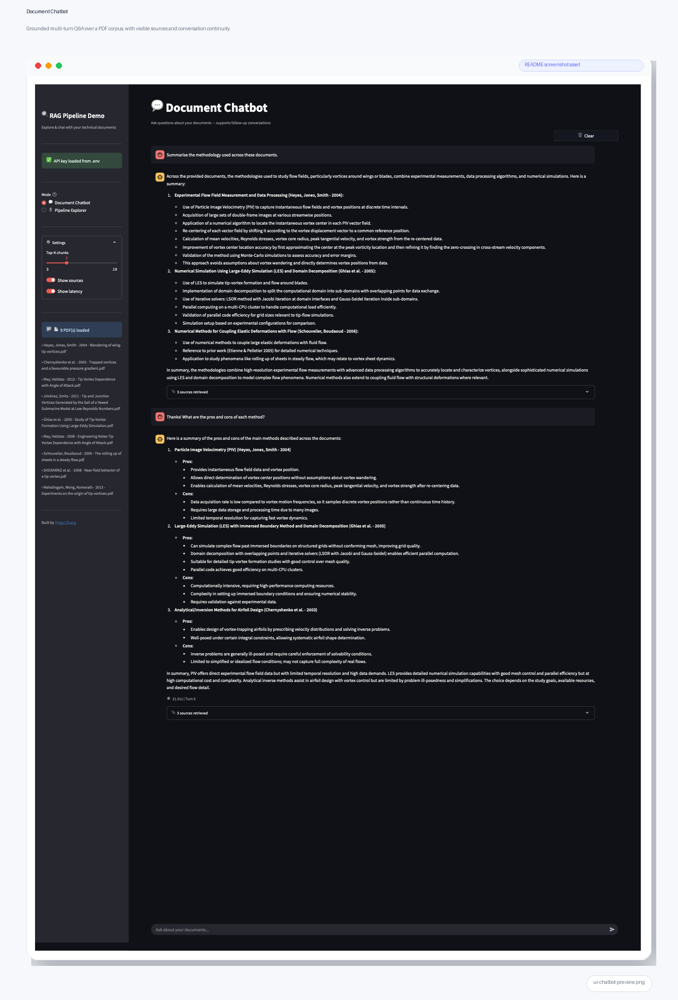
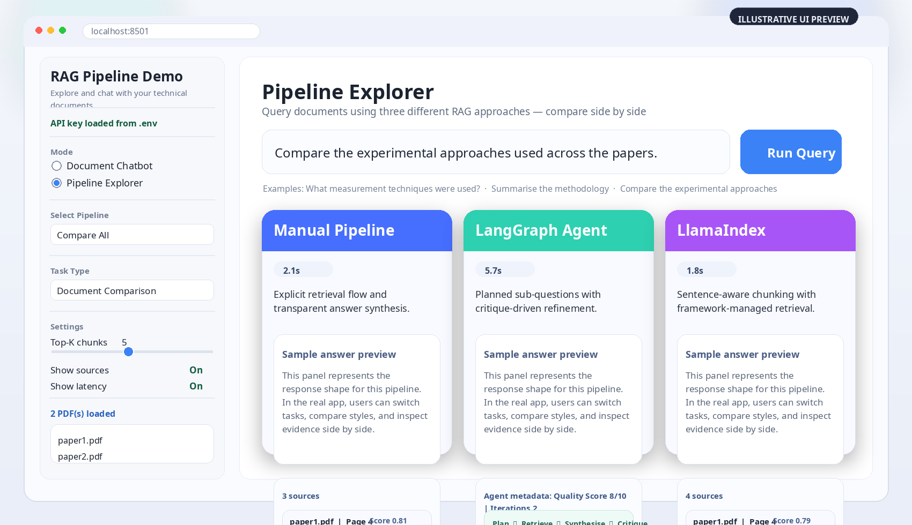
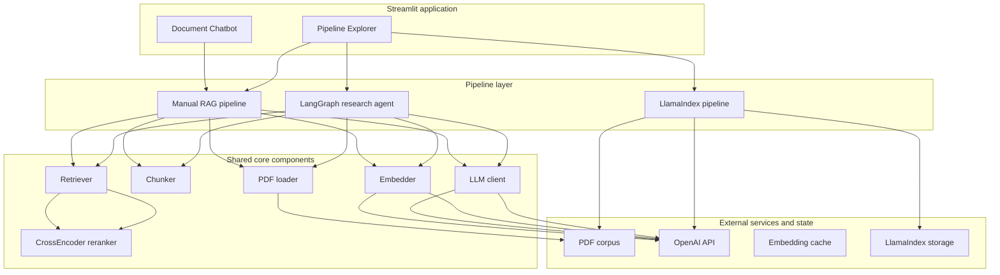
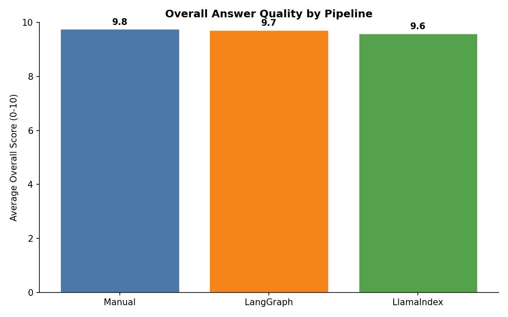
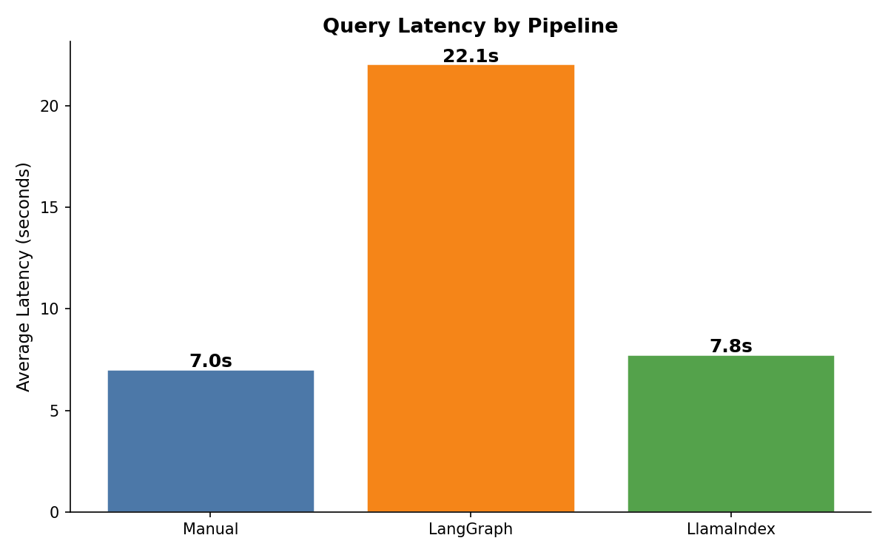
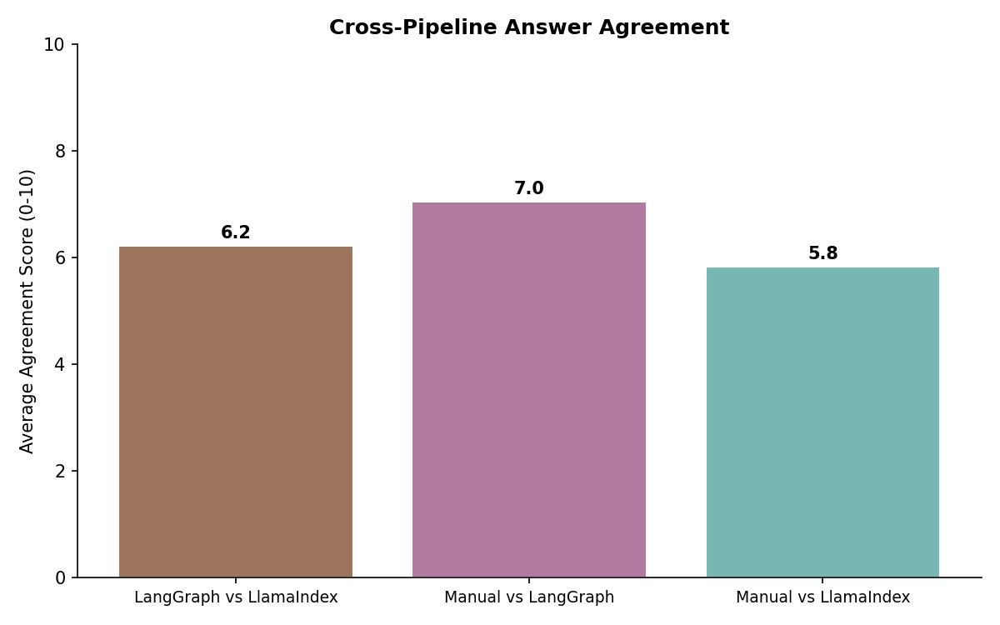
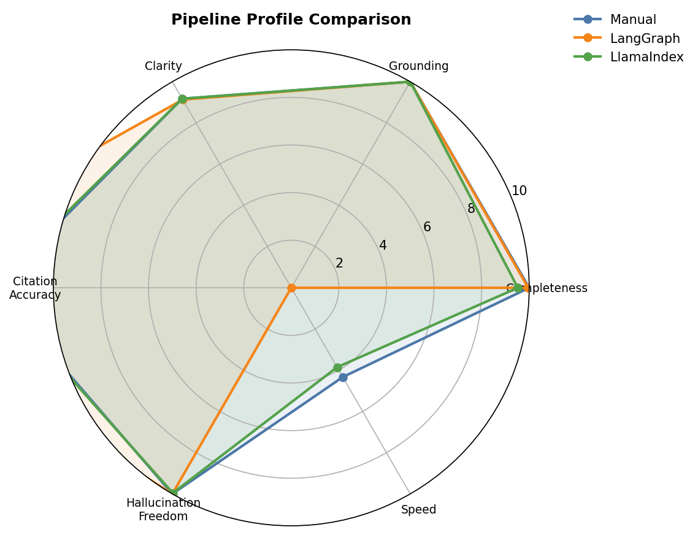
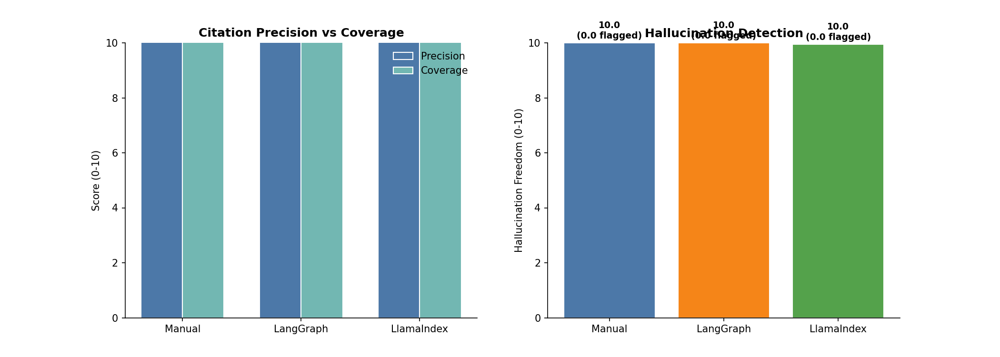

# RAG LLM Workflow for Technical Document Analysis

<p align="center">
  
</p>

<p align="center">
  
  
  
  
  
  
</p>

<p align="center">
  <strong>Three RAG architectures. One shared problem. One portfolio-ready demo of retrieval, orchestration, evaluation, and product thinking.</strong>
</p>

<p align="center">
  This project compares a manual RAG pipeline, a LangGraph research agent, and a LlamaIndex pipeline on the same technical-document workflow: grounded Q&amp;A, structured extraction, and document comparison over PDF collections.
</p>

<p align="center">
  <a href="#why-this-project-is-interesting">Why it matters</a>
  .
  <a href="#product-preview">Product preview</a>
  .
  <a href="#architecture-at-a-glance">Architecture</a>
  .
  <a href="#evaluation-snapshots">Evaluation</a>
  .
  <a href="#quick-start">Quick start</a>
  .
  <a href="#about-the-builder">About the builder</a>
  .
  <a href="docs/DESIGN_TRADEOFFS.md">Design notes</a>
</p>

---

## Why this project is interesting

Most RAG repos show a single stack. This one is intentionally comparative.

The same document-analysis problem is implemented three ways so the trade-offs are easy to see:

- **Manual pipeline** for transparency and low-level control.
- **LangGraph agent** for query decomposition and critique-driven refinement.
- **LlamaIndex pipeline** for higher-level abstractions and maintainability.

That makes the repo useful both as a working demo and as an engineering case study in **how architecture choices change developer control, retrieval behavior, latency, maintainability, and user experience**.

### What this repo demonstrates

| Signal | Evidence in the repo |
|---|---|
| End-to-end AI engineering | PDF ingestion, chunking, embedding, retrieval, reranking, generation, evaluation, and UI |
| Comparative system design | The same workflow is implemented with manual code, LangGraph, and LlamaIndex |
| Retrieval quality | Two-stage retrieval (cosine + CrossEncoder) for Manual and LangGraph; LlamaIndex-native retrieval for framework comparison |
| Product thinking | Streamlit app with a chatbot mode and side-by-side explorer |
| Evaluation discipline | LLM-as-judge scoring, citation accuracy, hallucination detection, latency tracking, agreement analysis, and saved charts |

---

## Product preview

<table>
  <tr>
    <td width="50%" valign="top">
      
      <p><strong>Document Chatbot</strong><br/>Multi-turn Q&amp;A over a PDF collection, with source cards, conversation history, and fast iteration for document exploration.</p>
    </td>
    <td width="50%" valign="top">
      
      <p><strong>Pipeline Explorer</strong><br/>Run one pipeline or compare all three side by side to highlight differences in reasoning style, latency, and retrieval behavior.</p>
    </td>
  </tr>
</table>

---

## Replace the starter preview panels with live screenshots

The two UI panels above are starter assets. Once you have your preferred PDFs loaded locally, you can replace them in place with real Streamlit captures:

```bash
python scripts/capture_readme_screenshots.py --launch-streamlit
```

That command is designed to overwrite these two files so the README updates automatically:

- `assets/readme/ui-chatbot-preview.png`
- `assets/readme/ui-explorer-preview.png`

If you want more control over the final look, use the shot list in `docs/README_SCREENSHOT_PLAYBOOK.md` and then polish raw captures with:

```bash
python scripts/frame_readme_screenshots.py \
  --chatbot-input raw/chatbot.png \
  --explorer-input raw/explorer.png
```

---

## What it does

- Answers questions over a folder of PDFs using retrieved evidence.
- Extracts structured information from technical documents.
- Compares multiple papers or reports side by side.
- Supports multi-turn document chat with grounded answers and source cards.
- Benchmarks all three pipelines on the same evaluation set.

### Core tasks supported

| Task | Example |
|---|---|
| Grounded Q&amp;A | *What measurement techniques were used?* |
| Structured extraction | *Extract the objective, methods, datasets, and findings.* |
| Document comparison | *Compare the experimental approaches used across the papers.* |
| Follow-up chat | *Can you go into more detail on the PIV setup?* |

---

## Architecture at a glance



The shared retriever plus CrossEncoder reranker path is used by the **Manual** and **LangGraph** pipelines. The **LlamaIndex** pipeline intentionally keeps its native framework-managed query path so the abstraction trade-off stays visible.

### Canonical project path

For a quick, high-signal tour of the repo, start here:

1. `app/streamlit_app.py` - user-facing demo.
2. `src/pipelines/` - the three implementations.
3. `src/core/` - reusable RAG building blocks.
4. `src/evaluation/evaluate_pipelines.py` - comparison harness.
5. `docs/DESIGN_TRADEOFFS.md` - rationale behind the architecture choices.

---

## Three implementation strategies

| Pipeline | Core idea | Strengths | Trade-offs | Best fit |
|---|---|---|---|---|
| **Manual** | Build the full retrieval pipeline from first principles | Maximum transparency, explicit prompts, easy debugging of each stage | More boilerplate, simpler chunking/indexing | Learning, prototyping, custom behavior |
| **LangGraph** | Use a graph-based agent to plan, retrieve, synthesize, and critique | Better coverage for multi-part questions, explicit orchestration, agent traceability | More moving parts and higher latency/cost | Complex questions, research workflows, agentic RAG |
| **LlamaIndex** | Use a mature framework for ingestion, indexing, and querying | Less code, sentence-aware chunking, built-in persistence | Less low-level control | Maintainable production-style RAG |

### Comparison matrix

| Aspect | Manual | LangGraph | LlamaIndex |
|---|---|---|---|
| Abstraction level | Low | Medium | High |
| Retrieval pattern | Single-query retrieval | Multi-step, query decomposition | Framework-managed retrieval |
| Reranking | CrossEncoder (shared core) | CrossEncoder (shared core) | No shared CrossEncoder reranker |
| Chunking style | Character-based | Character-based | Sentence-aware |
| Self-correction loop | No | Yes | No |
| Index persistence | Cache-based | Cache-based | Built-in storage |
| Main value | Control | Coverage and orchestration | Maintainability |

---

## Interactive demo

The Streamlit app is the fastest way to understand the project.

| Mode | What you can do | What it demonstrates |
|---|---|---|
| **Document Chatbot** | Ask follow-up questions over your PDF set | Multi-turn document chat, source grounding, session-aware UX |
| **Pipeline Explorer** | Run one pipeline or compare all three side by side | Architectural trade-offs in quality, latency, and response style |

Run the app locally:

```bash
streamlit run app/streamlit_app.py
```

---

## Evaluation snapshots

The repo includes an evaluation harness plus saved charts in `eval_results/` so reviewers can quickly inspect quality, latency, citation accuracy, hallucination rates, and agreement trends. The harness runs 12 queries across six categories (factual, summary, technical, comparison, critical, and unanswerable) through all three pipelines.

| Overall quality | Latency |
|---|---|
|  |  |

<details>
<summary>More evaluation charts</summary>

| Agreement | Radar profile |
|---|---|
|  |  |

| Citation & hallucination detail |
|---|
|  |

</details>

### Metrics used

| Metric | What it measures |
|---|---|
| Completeness | Does the answer address the full question? |
| Grounding | Are claims supported by retrieved evidence? |
| Clarity | Is the answer well-structured and readable? |
| Citation accuracy | Do inline source references match actually retrieved chunks? |
| Hallucination freedom | Are all factual claims supported, or are some fabricated? |
| Latency | How long does each pipeline take to respond? |
| Cross-pipeline agreement | Do the pipelines converge on similar conclusions? |

Run the evaluator:

```bash
python -m src.evaluation.evaluate_pipelines
```

Outputs are written to:

- `eval_results/evaluation_results.csv`
- `eval_results/01_overall_quality.png`
- `eval_results/02_quality_breakdown.png`
- `eval_results/03_latency.png`
- `eval_results/04_per_query.png`
- `eval_results/05_agreement.png`
- `eval_results/06_radar.png`
- `eval_results/07_citation_hallucination.png`

---

## Quick start

### 1) Clone and install

```bash
git clone https://github.com/4nechoic-hub/rag-llm-workflow.git
cd rag-llm-workflow

python -m venv venv
```

Activate the environment:

```bash
# macOS / Linux
source venv/bin/activate

# Windows PowerShell
venv\Scripts\Activate.ps1
```

Install dependencies:

```bash
pip install -r requirements.txt
```

### 2) Configure the API key

Create a `.env` file in the project root:

```bash
OPENAI_API_KEY=sk-your_api_key_here
```

### 3) Add documents

Place PDF files in `pdfs/`:

```text
rag-llm-workflow/
└── pdfs/
    ├── paper1.pdf
    ├── paper2.pdf
    └── ...
```

### 4) Launch the demo

```bash
streamlit run app/streamlit_app.py
```

### 5) Run the evaluation suite

```bash
python -m src.evaluation.evaluate_pipelines
```

---

## Repository guide

<details>
<summary>Show project structure</summary>

```text
rag-llm-workflow/
├── app/
│   └── streamlit_app.py
├── assets/
│   └── readme/
│       ├── hero-banner.png
│       ├── ui-chatbot-preview.png
│       └── ui-explorer-preview.png
├── docs/
│   ├── DESIGN_TRADEOFFS.md
│   └── README_SCREENSHOT_PLAYBOOK.md
├── eval_results/
├── pdfs/
├── scripts/
│   ├── capture_readme_screenshots.py
│   └── frame_readme_screenshots.py
├── src/
│   ├── config.py
│   ├── core/
│   │   ├── chunker.py
│   │   ├── embedder.py
│   │   ├── llm.py
│   │   ├── pdf_loader.py
│   │   ├── retriever.py
│   │   └── types.py
│   ├── evaluation/
│   │   └── evaluate_pipelines.py
│   └── pipelines/
│       ├── chatbot.py
│       ├── langgraph_agent.py
│       ├── llamaindex_pipeline.py
│       └── manual_pipeline.py
├── cache/
├── llamaindex_storage/
├── requirements.txt
└── README.md
```

</details>

---

## Running the pipelines directly

<details>
<summary>Python examples</summary>

```python
# Manual pipeline
from src.pipelines.manual_pipeline import build_manual_pipeline, answer_question

df_chunks, embeddings = build_manual_pipeline()
result = answer_question("What methods were used?", df_chunks, embeddings)
print(result.answer)
print(result.source_dicts)
```

```python
# LangGraph research agent
from src.pipelines.langgraph_agent import build_langgraph_pipeline, run_research_agent

agent = build_langgraph_pipeline()
result = run_research_agent(
    agent,
    query="Compare the experimental approaches used across the papers.",
    task_type="Document Comparison",
    top_k=5,
)
print(result.answer)
print(result.metadata)  # quality_score, iterations, sub_questions, critique
```

```python
# LlamaIndex pipeline
from src.pipelines.llamaindex_pipeline import build_index, answer_question

index = build_index()
result = answer_question("Summarise the methodology.", index)
print(result.answer)
```

```python
# Chatbot
from src.pipelines.chatbot import RAGChatbot
from src.pipelines.manual_pipeline import build_manual_pipeline

df_chunks, embeddings = build_manual_pipeline()
bot = RAGChatbot(df_chunks, embeddings)
response, sources = bot.chat("What measurement techniques were used?")
print(response)
```

</details>

---

## Tech stack

| Category | Tools |
|---|---|
| Language | Python 3.10+ |
| Models | OpenAI `gpt-4.1-mini`, `text-embedding-3-small` |
| Reranking | CrossEncoder `ms-marco-MiniLM-L-6-v2` (sentence-transformers) |
| Agent framework | LangGraph |
| RAG framework | LlamaIndex |
| UI | Streamlit |
| PDF processing | PyMuPDF |
| Retrieval math | NumPy, scikit-learn |
| Data handling | pandas |
| Visualisation | Matplotlib |

---

## Design notes

The deeper architectural rationale is documented in [`docs/DESIGN_TRADEOFFS.md`](docs/DESIGN_TRADEOFFS.md).

That write-up focuses on the question behind the project:

> What is the right level of abstraction for a technical RAG system?

This repo answers that question by implementing the same workflow three ways and comparing the engineering consequences of each choice.

---

## About the builder

### About me

I am **Tingyi Zhang**, a Postdoctoral Research Associate at **UNSW Sydney** focused on applied AI, aerodynamics and aeroacoustics.

I like building projects that are rigorous enough for research conversations and polished enough for real users to explore.

### What I built

This repository is a comparative **RAG system for technical PDFs**.

Instead of implementing one happy-path stack, I built the same core workflow three different ways:

- a **manual pipeline** to show the low-level mechanics clearly
- a **LangGraph agent** to test decomposition, critique, and iterative refinement
- a **LlamaIndex pipeline** to evaluate what a higher-level framework buys you in speed and maintainability

I then wrapped those pipelines in a **Streamlit interface** with both a chatbot mode and a side-by-side explorer, and added an **evaluation harness** that scores answer quality, citation accuracy, hallucination freedom, latency, and cross-pipeline agreement across 12 evaluation queries.

All three pipelines share a **unified `PipelineResult` contract**. Manual and LangGraph share a **two-stage retrieval system** — cosine similarity for broad recall, followed by CrossEncoder reranking for precision — so improvements to the shared core benefit both backends automatically. LlamaIndex deliberately uses its own framework-native retrieval path, providing a direct comparison of custom vs. framework-managed retrieval (see [`docs/DESIGN_TRADEOFFS.md`](docs/DESIGN_TRADEOFFS.md)).

### What this project says about how I work

For hiring managers, this project is meant to reflect the way I approach AI engineering work:

- I like to understand the **first principles** before hiding them behind abstractions.
- I care about **trade-offs**, not just whether something works once.
- I try to build with both **system design** and **user experience** in mind.
- I document **why** decisions were made, not only **what** was built.
- I value projects that are useful as both a **working prototype** and a **clear technical artifact**.

### What I would improve next

If I continued this project, the next steps I would prioritise are:

- adding stronger conversational retrieval for follow-up questions
- adding token usage tracking for cost comparison across pipelines
- deploying a polished public demo with curated sample PDFs and production-quality screenshots
- adding hybrid BM25 + dense retrieval as a fourth pipeline option
- implementing streaming responses in the Streamlit UI for better UX

---

## Author

**Tingyi Zhang**  
Postdoctoral Research Associate, UNSW Sydney  
GitHub: [4nechoic-hub](https://github.com/4nechoic-hub)  
LinkedIn: [tingyi-zhang-au](https://www.linkedin.com/in/tingyi-zhang-au/)

---

## License

Released for portfolio and educational use.